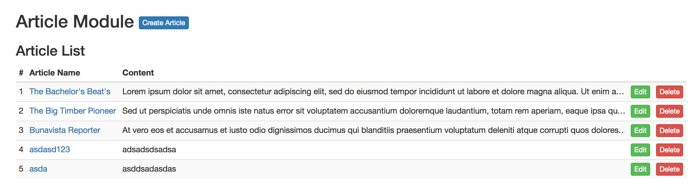

# Exercise 1

In this exercise we will create a dynamic article list as the screen shot below:

[](screenshot.jpg)

## Instructions

In the `exercise1/src/Article/ArticleListScreen.js` path we will have a hardcoded article in a table and a no-articles message.

We will have to make the list dynamic and show the no-articles message only when the list is empty.

### Step 1 - Get the Article List

There are some demo articles on the `json-server` database. Let's get them using Redux Workflow.

First create the Action. 

Open `ArticleActions.js` and get the `getListResource` from `ArticleResources.js`.

```js
import {getListResource} from './ArticleResources';
```

Create the action function and export it.

```js
export function getList(query) {
  return {
    type: 'article/getList',
    payload: getListResource(query)
  }
}
```

Now every time the action is called it will call the resource that brings the article list.

### Step 2 - Call the Action in the List Screen

Open `ArticleListScreen.js` file and import the action:

```js
import {getList} from './ArticleActions';
```

When the react component will mount, call the Action. Create a `componentWillMount` method in the Component:

```js
componentWillMount() {
  getList();
}
```

(Method `componentWillMount` is part of React Components LifeCycle. See more [here](https://facebook.github.io/react/docs/react-component.html).)

Now every time the component mounts, the action function is called.

But the action is a simple function if is not dispatched with redux. To do that import the `connect` method from `react-redux` library.

```js
import {connect} from 'react-redux';
```

Then use connect as decorator for the Component and make the `getList` action function dispatchable.

```js
@connect(state=>({
  // redux state variables
}), {
  // redux actions
  getList
})
```

This will insert the `getList` method in the Component's props. Get the function from there:

```js
componentWillMount() {
  const {getList} = this.props;
  getList();
}
```

Now the action is dispatched properly on the Component's mounting state. 

### Step 3 - Create the reducer case for the getList action

Open `ArticleReducer.js` and add the getList case:

```js
// GET LIST
case 'article/getList_loading': {
  return {
    ...state,
    listLoading: true
  };
}
case 'article/getList_success': {
  return {
    ...state,
    listLoading: false,
    list: action.payload.data
  };
}
case 'article/getList_error': {
  return {
    ...state,
    listLoading: false
  };
}
```

Notice that the action is `article/getList` and the reducer cases are `article/getList_<state>`. 

That is because when making a request, there are 3 reducer steps: 

- `loading` When the server request is made 
- `success` When the server response is successful 
- `error` When the server response is unsuccessful

### Step 4 - Display the Article List

Now the dispatched action `getList` is listened by the reducer and assigned the list variable on the redux state.

Let's get the list state from redux. Edit the @connect decorator:

```js
@connect(state=>({
  list: state.article.list
}), {
  getList
})
```

Get the list redux state from props:

```js
const {list} = this.props;
```

Now we have in the Component's `props` the list prop. Let's replace the hardcoded with dynamic:

```js
{list && (list.length ? (
  <table className="table table-striped table-condensed">
    <thead><tr>
      <th>#</th>
      <th>Article Name</th>
      <th>Content</th>
      <th />
      <th />
    </tr></thead>
    <tbody>
    { list.map((article, k)=>(
      <tr>
        <td>
          {k+1}
        </td>
        <td className="title">
          <a>{article.title}</a>
        </td>
        <td className="content">
          <p>{article.content}</p>
        </td>
        <td>
          <a className="btn btn-xs btn-success">Edit</a>
        </td>
        <td>
          <button className="btn btn-xs btn-danger">Delete</button>
        </td>
      </tr>
    )) }
    </tbody>
  </table>
) : (
  <div className="alert alert-info">There are no articles found</div>
))}
```

### Step 5 - Move the List Item into a separate file

As best practice, our project should be separated in as many blocks of code as we can. For organization and reusability purpose.

Let's create a `ArticleListItem.js` file in a template folder. Full path should be: `exercise1/src/Article/templates/ArticleListItem.js`

Move the code as follows: 

```js
import React from 'react';

export default class ArticleListItem extends React.Component {
  render() {
    const {article, k} = this.props;
    return (
      <tr>
        <td>
          {k+1}
        </td>
        <td className="title">
          <a>{article.title}</a>
        </td>
        <td className="content">
          <p>{article.content}</p>
        </td>
        <td>
          <a className="btn btn-xs btn-success">Edit</a>
        </td>
        <td>
          <button className="btn btn-xs btn-danger">Delete</button>
        </td>
      </tr>
    );
  }
}
```

In the `ArticleListScreen.js` import the template above:

```js
import ListItem from './templates/ArticleListItem';
```

And replace the map:

```js
{ list.map((article, k)=><ListItem key={k} article={article} k={k} />) }
```

**Voila!** We have now a dynamic article list.

### Last step - Add a loader to the list

Import the `Loader` component:

```js
import {Loader} from 'ContentComponents';
```

Import the list loading redux state on the @connect decorator:

```js
@connect(state=>({
  list: state.article.list,
  loading: state.article.listLoading
}), {
  getList
})
```

Get the loading redux state from props:

```js
const {list, loading} = this.props;
```

After the list, add the loader spinner:

```js
{loading && <Loader />}
```


## Next Exercise

Go the [Exercise 2](../../exercise2/docs/Instructions.md) to continue the workshop.
