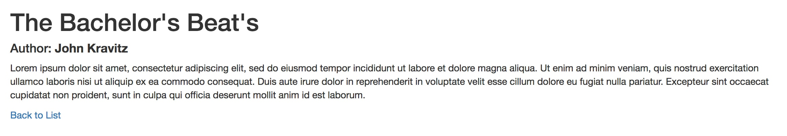
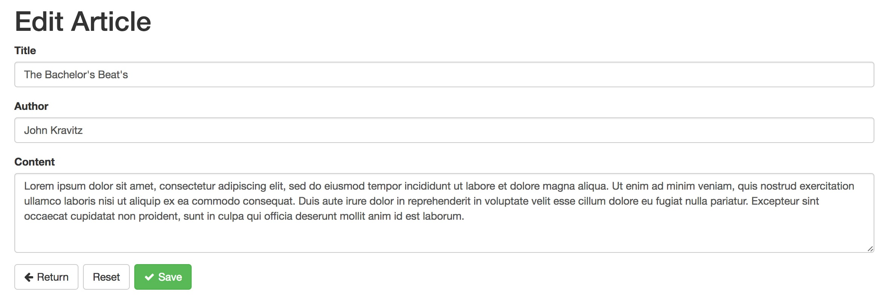

# Exercise 2

In this exercise we will make the CRUD (Create Read Update Delete) for the Articles. New screens:

Article View Screen

[](screenshot-view.jpg)

Article Add / Edit Screen

[](screenshot-edit.jpg)

## Instructions

First we will create the view screen and then the add / edit screen. Each must have the route configured and a Screen Component attached.

### Step 1 - Create the new components, routes and links.

Create a `ArticleViewScreen.js` file and populate it with some dummy data:

```js
import React from 'react';

export default class ArticleViewScreen extends React.Component {
  render() {
    return (
      <div className="container">
        <article>
          <h1>Article name</h1>
          <h4>Author: <strong>Author Name</strong></h4>
          <p>Some content</p>
          <Link to={{name: 'ArticleList'}}>Back to List</Link>
        </article>
      </div>
    );
  }
}
```


Create a `ArticleEditScreen.js` file and populate it with some dummy data:

```js
import React from 'react';

export default class ArticleEditScreen extends React.Component {
  render() {
    return (
      <form className="container">

        <h1>Edit Article</h1>

        <fieldset>
          <p>Title</p>
          <p>Author</p>
          <p>Content</p>
        </fieldset>

        <div className="form-actions">
          <p>Actions</p>
        </div>

      </form>
    );
  }
}
```

In the `ArticleRoutes.js`:

Import the newly created components:

```js
import ArticleView from './ArticleViewScreen';
import ArticleEdit from './ArticleEditScreen';
```

Assign them to the article's child routes:

```js
childRoutes: [
  {path: 'add', name: 'ArticleAdd', component: ArticleEdit},
  {path: ':articleId', name: 'ArticleView', component: ArticleView},
  {path: ':articleId/edit', name: 'ArticleEdit', component: ArticleEdit}
]
```

In the `ArticleListScreen.js`, replace the create article button with a Link component:

```js
<Link className="btn btn-primary btn-xs" to={{name: 'ArticleAdd'}}>Create Article</Link>
```

And don't forget to import the `Link` component.

```js
import {Link} from 'react-router';
```

In the `ArticleListItem.js` import the `Link` component as above and:

Create the view link on the title:

```js
<td className="title">
  <Link to={{name: 'ArticleView', params: {articleId: article.id}}}>{article.title}</Link>
</td>
```

Replace the edit link button:

```js
<td>
  <Link to={{name: 'ArticleEdit', params: {articleId: article.id}}} className="btn btn-xs btn-success">Edit</Link>
</td>
```

Conclusion: we have created the view + add / edit components, linked to the routes and created the links for them.

### Step 2 - Populate the view screen

In `ArticleViewScreen.js`, repeat the same workflow for getting data as on the article list component:

```js
import React from 'react';
import {connect} from 'react-redux';
import {Loader} from 'ContentComponents';
import {Link} from 'react-router';
import {getItem} from './ArticleActions';


@connect(state=>({
  article: state.article.item,
  loading: state.article.itemLoading
}), {
  getItem
})
export default class ArticleViewScreen extends React.Component {
  componentWillMount() {
    const {getItem, params: {articleId}} = this.props;
    getItem(articleId);
  }
  render() {
    const {article, loading} = this.props;
    return (
      <div className="container">
        {article && (
          <article>
            <h1>{article.title}</h1>
            <h4>Author: <strong>{article.author}</strong></h4>
            <p>{article.content}</p>
            <Link to={{name: 'ArticleList'}}>Back to List</Link>
          </article>
        )}
        {loading && <Loader />}
      </div>
    );
  }
}
```

We have connected the component with redux: the `getItem` action and `article` and `loading` data props.

On mounting state, we requested get article.

In the render method, we show the `<article>` only if the article property is defined.

We have add the loading spinner when the request is in loading mode.

### Step 3 - Create the Article Add / Edit form

In `ArticleEditScreen.js`, in `componentWillMount` method, check if the component is in add or edit mode.

If it is not in add mode, get the item.

Please import the action and connect it to redux as we learned.

```js
componentWillMount() {
  const {getItem, params: {articleId}, initialize} = this.props;
  this.addMode = !articleId;
  if(!this.addMode) getItem(articleId);
}
```

To create the form we must have 3 elements:

- The @reduxForm decorator
- The <form> element
- The <Field /> component

For populating the form fields data, we must do `this.props.initialize(dataObject)`.

First import reduxForm and form components:

```js
import {reduxForm} from 'redux-form';
import {Field, SubmitButton, ReturnButton, ResetButton, Validate} from 'FormComponents';
```

Then, decorate the component with reduxForm: (below @connect decorator)

```js
@reduxForm({form: 'ArticleEditForm')
```

Add the components:

```js
<fieldset disabled={saveLoading}>
  <Field name="title" label="Title" />
  <Field name="author" label="Author" />
  <Field name="content" label="Content" type="textarea" />
</fieldset>

<div className="form-actions">
  <ReturnButton route={{name: 'ArticleList'}} />
  <ResetButton reset={reset} />
  <SubmitButton loading={saveLoading}>Save</SubmitButton>
</div>
```

The whole code is wrapped into a <form> element, so we are good to go.

The thing that is missing is that when we are in edit mode, we must initialize the form with the data:

```js
if(!this.addMode) getItem(articleId).then(response=>{
  initialize(response.value.data);
});
```

Now, when we are editing a Article, the fields should populate.

For more details on reduxForm go [here](http://redux-form.com/).

The last thing we should add the loader when the data is loading:

```js
{getLoading && <Loader />}
```

### Step 4 - Submit data and validate Add / Edit form

To submit data add a onSubmit event lister:

```js
<form className="container" onSubmit={handleSubmit(this.onSubmit.bind(this))}>
...
</form>
```

The handleSubmit is a reduxForm method that works as a wrapper for the native submit event that also makes validation.

The onSubmit is a component method. Let's define it:

```js
onSubmit(formData) {
  console.log('formData', formData);
}
```

Next, define the validation:

```js
@reduxForm({form: 'ArticleEditForm', validate: Validate({
  title: {required: true},
  author: {required: true},
  content: {required: true}
})})
```

Now, if you click the Save button, the fields that are empty, a required error pops.

If all your fields are not empty, the `onSubmit` method runs and a console.log shows.

To really save the form, let's make the logic:

If it is Add Mode, create the article and go to it's edit page.

If is is Edit mode, update the article and re-initialize the form.

For every case, add a toast message.

```js
onSubmit(formData) {
  const {createItem, updateItem, initialize, router} = this.props;
  if(this.addMode) {
    createItem(formData).then(response=>{
      toastr.success('You have updated the article successfully!');
      router.push({name: 'ArticleEdit', params: {articleId: response.value.data.id}});
    })
  } else {
    updateItem(formData).then(response=>{
      toastr.success('You have created the article successfully!');
      initialize(response.value.data);
    })
  }
}
```

Don't forget to import the toastr method

```js
import {toastr} from 'react-redux-toastr';
```

Reset the article item:

```js
componentWillUnmount() {
  this.props.resetItem();
}
```

Add the `getItem`, `saveItem` and `resetItem` actions and reducer cases for what we've made:

```js
// GET ITEM
case 'article/getItem_loading': {
  return {
    ...state,
    itemLoading: true
  };
}
case 'article/getItem_success': {
  return {
    ...state,
    itemLoading: false,
    item: action.payload.data
  };
}
case 'article/getItem_error': {
  return {
    ...state,
    itemLoading: false
  };
}


// SAVE ITEM
case 'article/saveItem_loading': {
  return {
    ...state,
    saveLoading: true
  };
}
case 'article/saveItem_success': {
  return {
    ...state,
    saveLoading: false
  };
}
case 'article/saveItem_error': {
  return {
    ...state,
    saveLoading: false
  };
}


// RESET ITEM
case 'article/resetItem': {
  return {
    ...state,
    item: initialState.item
  };
}
```

### Last Step - Add delete Article functionality

In `ArticleListItem.js`, add a `deleteItem` method to the component:

```js
deleteItem() {
  if(confirm('Are you sure?')) {
    console.log('Deleting...');
  }
}
```

And then assign the method to the button's onClick event listener:

```js
<button onClick={this.deleteItem.bind(this)} className="btn btn-xs btn-danger">Delete</button>
```

Now when we click the `Delete` button, we show a confirm box and if we press ok, the console logs 'Deleting...'

Let's add the real functionality to the delete button. Create the action, import it, bind it with @connect and then:

```js
const {article, deleteItem} = this.props;
if(confirm('Are you sure?')) {
  deleteItem(article.id);
}
```

Notice that when deleting the article, it does not disappear. That is because the list state is the same.

To remove the item we could manually remove the item through the reducer or reload the list.

The reload method is better because is the list is paginated, the item from the next page should be brought.

So, after we delete the item, we should get the list again. To do that we should pass the `getList` action on this component from `ArticleListScreen.js`:

```js
{ list.map((article, k)=><ListItem key={k} article={article} k={k} getList={this.props.getList} />) }
```

Then in `ArticleListItem.js`, after deleting the item, reload the list:

```js
const {article, deleteItem, getList} = this.props;
if(confirm('Are you sure?')) {
  deleteItem(article.id).then(getList);
}
```

Now you can do a full CRUD on the Articles. Congratulations!

## Next Exercise

Go the [Exercise 3](../../exercise3/docs/Instructions.md) to continue the workshop.
