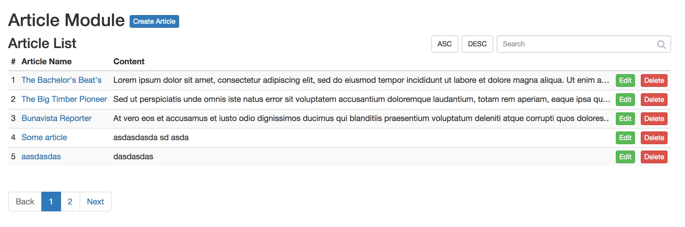

# Exercise 3

In this exercise we will create the pagination for our article list, add a search and order ASC and DESC.

It should look like this:

[](screenshot.jpg)

## Instructions

We will first add some dummy articles, create the pagination, and then the search and ordering.

#### Step 1 - Create the pagination

Before adding the pagination component, add dummy articles until you reach more than 5.

Then go to the `ArticleResources.js` and change the default size on `getListResource` function from 999 to 5.

```js
export function getListResource({page = 1, size = 5, search, order}={}) {
...
}
```

If we refresh, we now see only 5 articles. Why is that? Because now the query is set to page 1, 5 items per page.

To navigate to page 2 or more, let's import the `Pagination` component:

```js
import {Loader, Pagination} from 'ContentComponents';
```

Then add the component after the list:

```js
<Pagination totalPages={10} />
```

If we do this, we will see 10 pages on that component. This should be dynamic, not hardcoded.

To get the totalPages, we will get this from the response header. Go to `ArticleReducer.js` and add a totalPages prop:

```js
case 'article/getList_success': {
  return {
    ...state,
    listLoading: false,
    list: action.payload.data,
    totalPages: calculateTotalPages(parseInt(action.payload.headers['x-total-count']), 5)
  };
}
```

This takes the `x-total-count` header from the response and adds it to article redux state.

Next import it into the component through `@connect`, define the prop as variable in render and pass it to the pagination:

```js
<Pagination totalPages={totalPages} />
```

Now we have a pagination on the list. But if you try to change the page, nothing happens. That is because you must listen to location query modifications.

To do that you must import the `listenToLocation` utility.

```js
import {listenToLocation} from 'core/utils/helpers'
```

In the `componentWillMount` method, after getting the initial list, add a lister for more:

```js
const {getList, location: {query}} = this.props;
getList(query);
listenToLocation(()=>{
  const {getList, location: {query}} = this.props;
  getList(query);
}, this)
```

But if we must pass also the query object. But we have some duplicate code. We can resolve this with:

```js
componentWillMount() {
  this.getList();
  this.unlistenToLocation = listenToLocation(()=>{
    this.getList();
  }, this)
}
getList() {
  const {getList, location: {query}} = this.props;
  getList(query);
}
```

The query object is an object containing the url queries.

Example: `http://www.some-site.com/page?oneProp=value&otherProp=other-value`

is

```js
query = {oneProp: 'value', otherProp='other-value'};
```

With this modification, every the we change the url query, the `listenToLocation` callback is executed and the list is brought.

Affected by this modification is also the passing of `getList` to the `ListItem` compoent:

```js
{ list.map((article, k)=><ListItem key={k} article={article} k={k} getList={this.getList.bind(this)} />) }
```

#### Step 2 - Create the search input

First import the component in `ArticleListScreen.js`:

```js
import {Loader, Pagination, SearchInput} from 'ContentComponents';
```

Then wrap the title into a `div.content-header` element and add the search component aside:

```js
<div className="content-header">
  <h3>Article List</h3>
  <SearchInput />
</div>
```

You can now search in all the article fields (name, author, content).

#### Step 3 - Create the order buttons

In `ArticleListScreen.js`, in `render` method add the buttons in an array:

```js
const {list, loading, totalPages, location: {query}} = this.props;
const orderButtons = ['ASC', 'DESC'];
```

Then integrate the buttons into the `.content-header`:

```js
<button key={item} className={classnames('btn btn-sm btn-default', {'btn-primary': query.order==item})}
        onClick={()=>{setQueryParam('order', query.order == item ? null : item)}}>{item}</button>
```

The `classnames` utility creates the css class through 'string of classes' and / or {'className': boolean}. More [here](https://github.com/JedWatson/classnames).

The `setQueryParam` utility changes the location query prop. If is null or '' it is removed.

Now if we click the ASC or DESC buttons, the location query changes and the `listenToLocation` callback is executed and the list is reloaded.

## Workshop complete

Congratulation, you have finished the workshop!

You are now ready the create CRUD structure for entities in ReactJS!
